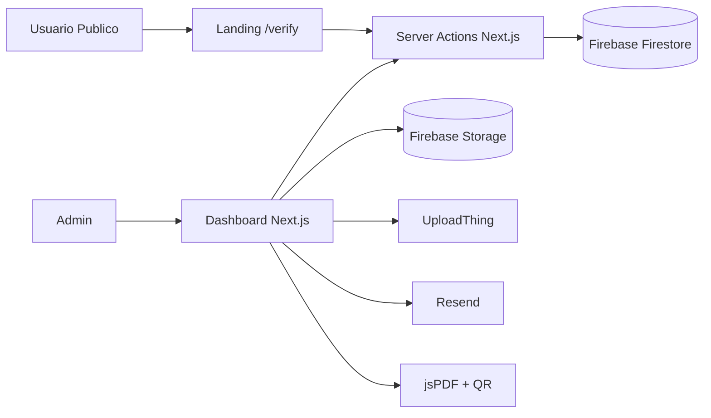
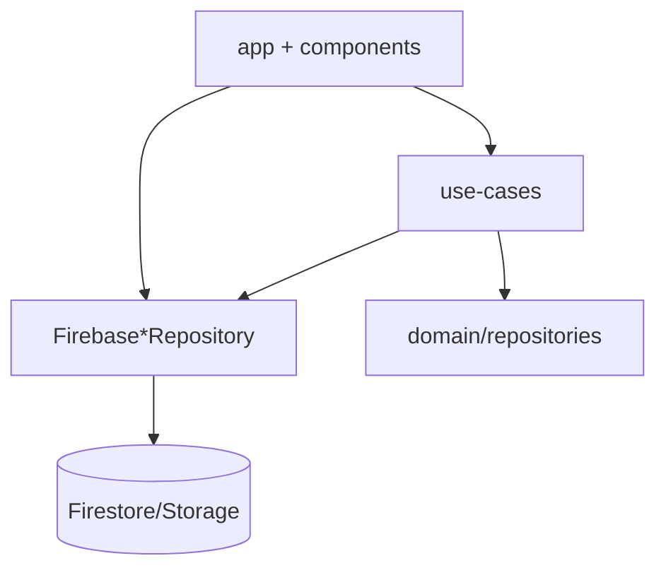
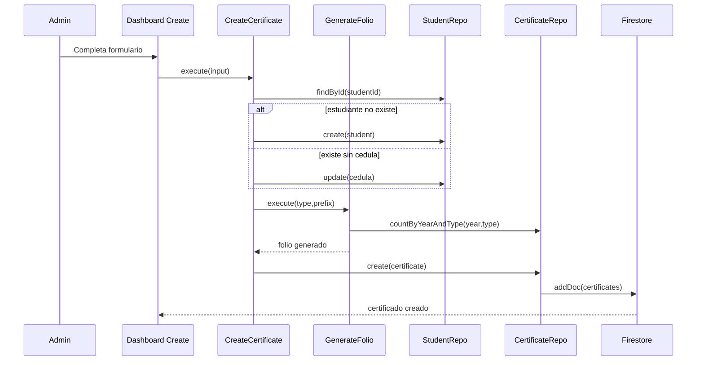
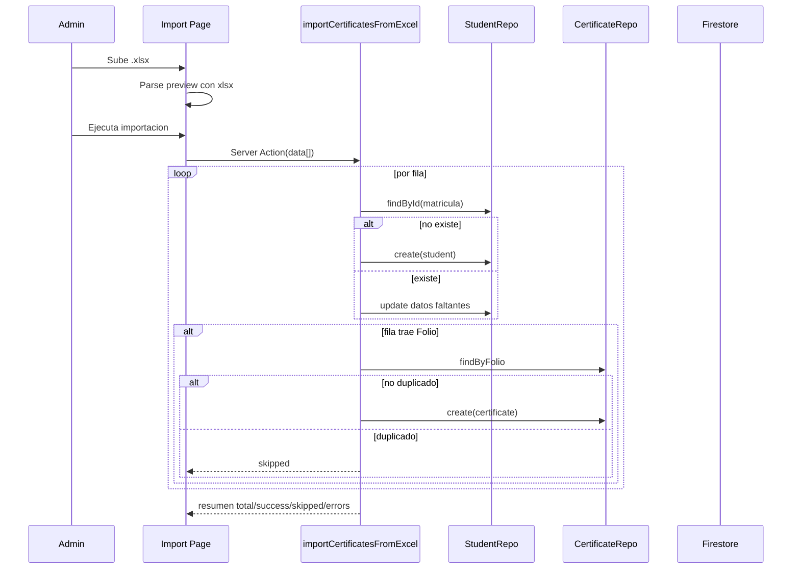
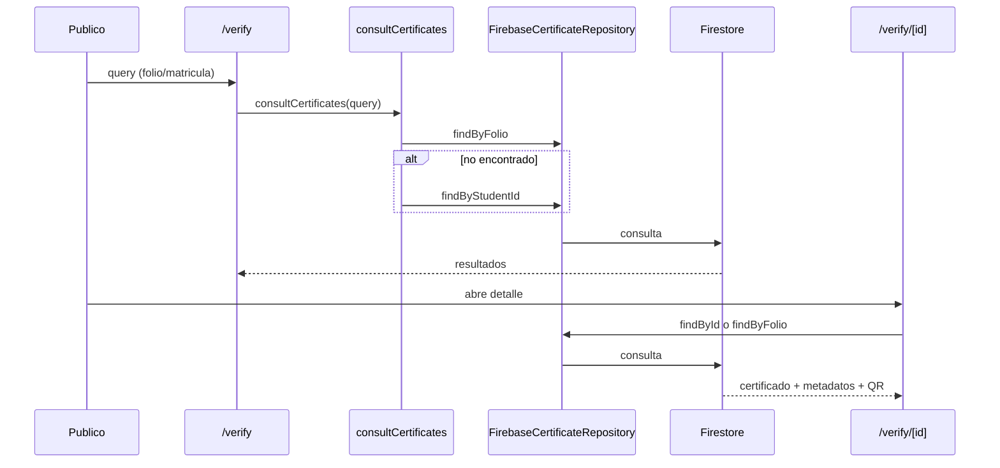
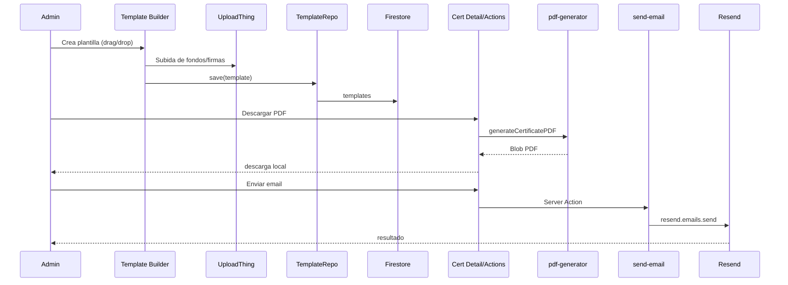

# Informe Integral del MVP SIGCE (Estado Real + Arquitectura + Brechas)

**Fecha de corte del informe:** 19 de febrero de 2026  
**Proyecto:** SIGCE - Sistema Integral de Gestion de Certificaciones  
**Tipo de informe:** Diagnostico tecnico-operativo para cierre de MVP

---

## 1. Resumen ejecutivo

El proyecto **SIGCE** tiene una base funcional importante para un MVP: autenticacion, dashboard administrativo, gestion de certificados, gestion de participantes, importacion masiva desde Excel, consulta publica y descarga de PDF.

Sin embargo, el estado actual no esta listo para produccion institucional sin un hardening previo, por 4 razones principales:

1. **Seguridad critica pendiente:** reglas de Firestore/Storage abiertas o temporales.
2. **Control de acceso incompleto:** proteccion principal en cliente y sin RBAC real.
3. **Modulos clave aun incompletos/simulados:** validacion interna, reportes y usuarios.
4. **Riesgos de escalabilidad y consistencia:** folio no atomico, agregaciones full-scan y falta de pruebas automatizadas.

### Diagnostico general (semaforo)

- `Producto MVP funcional (demo interna):` **Verde**
- `MVP listo para operacion institucional real:` **Amarillo/Rojo**
- `Arquitectura base para evolucionar:` **Verde**
- `Seguridad y cumplimiento minimo:` **Rojo**

---

## 2. Alcance y metodologia

Este informe se construyo con:

- Revisión de codigo fuente real del repositorio.
- Revisión de arquitectura/documentacion existente en `docs/`.
- Validacion tecnica de build/lint local.
- Verificacion de limites de planes gratuitos en fuentes oficiales (Firebase, Vercel, Resend, UploadThing).

### Evidencia base revisada

- `app/actions/send-email.ts`
- `app/actions/import-certificates.ts`
- `app/actions/consult-certificates.ts`
- `app/dashboard/certificates/create/page.tsx`
- `app/dashboard/certificates/import/page.tsx`
- `app/dashboard/certificates/page.tsx`
- `app/dashboard/templates/create/page.tsx`
- `app/dashboard/validate/page.tsx`
- `app/dashboard/reports/page.tsx`
- `app/dashboard/users/page.tsx`
- `app/verify/page.tsx`
- `app/verify/[id]/page.tsx`
- `lib/application/utils/pdf-generator.ts`
- `lib/infrastructure/repositories/FirebaseCertificateRepository.ts`
- `lib/infrastructure/repositories/FirebaseStudentRepository.ts`
- `lib/infrastructure/repositories/FirebaseTemplateRepository.ts`
- `lib/contexts/AuthContext.tsx`
- `middleware.ts`
- `firestore.rules`
- `storage.rules`
- `README.md`

---

## 3. Objetivos del MVP (reconstruidos y aterrizados)

## 3.1 Objetivo estrategico

Digitalizar el ciclo de emision y verificacion de certificados academicos de forma trazable, consultable publicamente y operable por administracion.

## 3.2 Objetivos funcionales clave

1. Crear certificados con folio unico.
2. Registrar y consultar participantes.
3. Importar lotes masivos desde Excel.
4. Consultar certificados de forma publica por matricula/folio.
5. Ver detalle verificable con QR y metadatos.
6. Descargar certificado en PDF.
7. Administrar plantillas de certificados.
8. Habilitar envio por email.

## 3.3 Objetivos no funcionales esperados para salida MVP

1. Seguridad minima (control de acceso y reglas de DB).
2. Confiabilidad de folio (sin colisiones).
3. Escalabilidad inicial (sin full scans en modulos principales).
4. Observabilidad y calidad (pruebas minimas y CI tecnico).

---

## 4. Arquitectura actual (as-is)

## 4.1 Vista de contexto

## 4.2 Capas tecnicas reales

### Lectura tecnica

- Hay una intencion clara de Clean Architecture.
- Pero en la practica, varias pantallas consumen infraestructura directamente (repositorios Firebase) desde UI.
- Existen contratos duplicados/inconsistentes en repositorios (`ICertificateRepository.ts` y `CertificateRepository.ts`).

---

## 5. Flujos graficos principales

## 5.1 Flujo: creacion manual de certificado

## 5.2 Flujo: importacion masiva por Excel

## 5.3 Flujo: consulta publica y verificacion

## 5.4 Flujo: plantilla -> PDF -> descarga/envio

---

## 6. Estado actual por modulo

| Modulo | Estado | Observacion |
|---|---|---|
| Landing publica | `Implementado` | Home visual robusta con buscador y CTA a verificacion. |
| Consulta publica `/verify` | `Implementado` | Busca por folio exacto o matricula; resultados funcionales. |
| Detalle publico `/verify/[id]` | `Implementado` | Render de certificado y acciones de descarga/compartir/email. |
| Dashboard resumen | `Parcial` | KPIs reales, pero notificaciones son mock y pendiente de validacion es placeholder. |
| Certificados (listar) | `Implementado` | Lista real desde Firestore, sin filtros reales ni paginacion. |
| Certificados (crear) | `Implementado` | Usa caso de uso + folio + registro de estudiante. |
| Certificados (importar Excel) | `Implementado` | Proceso masivo funcional con resumen y tolerancia a errores. |
| Certificados (detalle admin) | `Implementado` | Vista detallada con QR y descarga PDF; acciones imprimir/compartir parcialmente cableadas. |
| Participantes (listar/crear/detalle) | `Implementado` | CRUD parcial efectivo (crear/listar/ver). |
| Programas | `Parcial` | Agregacion funcional pero con lectura completa de certificados (no escalable). |
| Plantillas (crear/listar/eliminar) | `Implementado` | Editor drag/drop + persistencia; boton editar aun sin flujo completo. |
| Validacion interna `/dashboard/validate` | `No implementado` | Simulacion local por longitud de texto. |
| Gestion de usuarios `/dashboard/users` | `No implementado` | Pantalla placeholder. |
| Reportes `/dashboard/reports` | `No implementado` | Pantalla placeholder. |
| Configuracion | `Parcial` | Cambio de foto funciona; seguridad/notificaciones sin backend real. |
| Admin legacy `/admin/*` | `Parcial/Legacy` | Rutas antiguas coexistiendo con nuevo dashboard; no unificadas. |

---

## 7. Lo que ya esta realizado (fortalezas)

1. **Base funcional completa de negocio principal** (crear, importar, consultar, verificar y descargar).
2. **Diseño UI avanzado y consistente** en la mayor parte del producto.
3. **Persistencia real en Firebase** para certificados, estudiantes y plantillas.
4. **Integracion de servicios externos**: UploadThing, Resend, QR/PDF.
5. **Changelog/versionado visible** en interfaz (`v0.4.0`).
6. **Modelo de dominio inicial existente** (entities + use-cases + repositories).

---

## 8. Lo que falta para MVP operativo real

## 8.1 Bloqueantes P0

1. Cerrar reglas abiertas de Firestore/Storage.
2. Implementar autorizacion real server-side (no solo client-side).
3. Definir RBAC (admin vs otros roles) con enforcement.
4. Corregir consistencia del modelo de certificados y QR.
5. Corregir bug de mapeo de estudiante (`cedula` no se mapea en read model).

## 8.2 Relevantes P1

1. Implementar validacion real en `/dashboard/validate`.
2. Implementar modulo usuarios y reportes.
3. Paginacion + filtros reales en listas.
4. Indices Firestore para consultas de crecimiento.
5. Auditoria basica de cambios (quien/que/cuando).

## 8.3 Calidad P2

1. Suite minima de pruebas (unit + integracion de flujos criticos).
2. Pipeline CI con lint/typecheck/build y pruebas.
3. Observabilidad (errores, trazas, alertas).

---

## 9. Hallazgos tecnicos criticos (riesgos)

## 9.1 Seguridad

1. `firestore.rules` permite `read, write` a todo hasta **20 de marzo de 2026**.
2. `storage.rules` permite `read, write: if true` sin autenticacion.
3. `middleware.ts` no protege rutas de forma efectiva (solo `NextResponse.next()`).
4. `app/api/uploadthing/core.ts` retorna `userId: "user"` y no valida identidad.

**Impacto:** exposicion de datos, escritura no autorizada, abuso de almacenamiento y riesgo reputacional.

## 9.2 Integridad de datos

1. Foliado por conteo (`count + 1`) no atomico -> riesgo de colision concurrente.
2. `FirebaseStudentRepository.mapDocToStudent` no retorna `cedula`.
3. DTO/entidad de certificado inconsistente: `qrCodeUrl` requerido en entidad, pero no garantizado en persistencia.

## 9.3 Escalabilidad

1. Modulo programas usa `findAll()` de certificados para agregar estadisticas.
2. Sin paginacion real en certificados/participantes.
3. Sin indices compuestos definidos (`firestore.indexes.json` vacio).

## 9.4 Mantenibilidad

1. Contratos de repositorio duplicados (`ICertificateRepository.ts` vs `CertificateRepository.ts`).
2. Mezcla de acceso directo a infraestructura desde UI y uso parcial de casos de uso.
3. Documentacion parcialmente desactualizada (README apunta a `design_system.md` inexistente).

## 9.5 Calidad tecnica observada

### Lint local

- Resultado: **2 errores, 12 warnings**.
- Error bloqueante principal en `app/admin/seed-template/page.tsx` por comillas no escapadas.

### Build local

- Compilacion y generacion de paginas: **OK**.
- Falla final por `EPERM symlink` al usar `output: 'standalone'` en entorno Windows sin permisos de symlink.

---

## 10. Limitaciones por planes gratuitos (MVP Free-First) y efecto practico

> Datos verificados en fuentes oficiales consultadas durante este informe (ver seccion de referencias).

## 10.1 Firebase Firestore (Spark)

- Cuotas gratuitas visibles en pricing: aprox. **1 GiB almacenamiento, 50k lecturas/dia, 20k escrituras/dia, 20k borrados/dia**.
- En crecimiento de uso, el cuello suele ser lecturas por dashboards/listados/agregaciones.

**Impacto MVP:** viable para piloto bajo/medio; se degrada rapido con consultas no optimizadas.

## 10.2 Firebase Storage / Cloud Storage

- Firebase anuncia cambio: desde **2-feb-2026** (FAQ) y en docs de inicio desde **3-feb-2026**, el bucket por defecto `*.appspot.com` puede requerir Blaze.
- Si proyecto no esta en Blaze, ciertas operaciones pueden bloquearse o forzar upgrade.

**Impacto MVP:** riesgo directo para plantillas, firmas y PDFs si se queda en Spark puro.

## 10.3 Firebase Authentication (Spark)

- Spark limita autentificacion por proyecto y tiene limites diarios/operativos en ciertos flujos.

**Impacto MVP:** suficiente para MVP universitario inicial; revisar limites concretos segun volumen de admins/usuarios activos.

## 10.4 Vercel Hobby

- Plan Hobby indicado como para uso personal/no comercial.
- Incluye umbrales de uso y fair-use; para operacion institucional sostenida, normalmente conviene Pro.

**Impacto MVP:** excelente para prueba/piloto tecnico; potencial conflicto al pasar a operacion formal institucional.

## 10.5 Resend

- Free tier reportado: **3,000 emails/mes** y **100 emails/dia**.

**Impacto MVP:** util para pruebas y lotes pequenos; se queda corto para jornadas de emision masiva.

## 10.6 UploadThing

- Plan gratuito visible con limites aproximados de **2GB almacenamiento**, **4GB egreso** y **4GB subida mensual** (segun pagina de pricing).

**Impacto MVP:** suficiente para arranque; puede agotarse rapido con imagenes de fondo grandes y operaciones frecuentes de plantilla.

---

## 11. Alternativas tecnicas y de costo (por etapa)

## 11.1 Opcion A - Hardening minimo manteniendo stack actual (recomendada corto plazo)

1. Pasar Firebase a Blaze controlado.
2. Mantener Next.js + Vercel (evaluar Pro si uso institucional formal).
3. Mantener Firestore pero optimizar consultas e indices.
4. Mantener Resend/UploadThing con alertas de consumo.

**Ventaja:** menor tiempo de salida.  
**Riesgo:** lock-in parcial y costos crecientes por consulta/egreso.

## 11.2 Opcion B - Evolucion costo-controlada

1. Auth/DB en Supabase (Postgres + RLS).
2. Archivos en Cloudflare R2 o S3-compatible economico.
3. Mantener frontend en Vercel o mover a infraestructura propia.

**Ventaja:** consultas SQL avanzadas/reportes robustos.  
**Riesgo:** migracion y curva operativa.

## 11.3 Opcion C - Institucional/enterprise

1. Backend dedicado (Nest/Fastify) + Postgres administrado.
2. Cola de jobs para PDF/email masivo (BullMQ/Cloud Tasks).
3. IAM formal + auditoria + observabilidad integral.

**Ventaja:** control total y compliance.  
**Riesgo:** mayor costo inicial y mayor complejidad.

---

## 12. Plan sugerido de cierre MVP (4 semanas)

## Semana 1 (P0 Seguridad)

1. Reescribir `firestore.rules` por coleccion y rol.
2. Reescribir `storage.rules` con autenticacion y rutas por contexto.
3. Implementar sesion server-side (cookie/token) para proteger dashboard en middleware.
4. Definir RBAC minimo (admin).

## Semana 2 (P0 Integridad y calidad minima)

1. Foliado atomico (contador transaccional o documento secuencial por tipo/anio).
2. Corregir mapeo de `cedula` y consistencia DTO/entidad certificado.
3. Corregir generacion PDF para elemento `qr` en plantillas.
4. Resolver errores de lint bloqueantes.

## Semana 3 (P1 Funcional)

1. Implementar validacion real en `/dashboard/validate`.
2. Implementar modulo minimo de usuarios (alta/baja/rol).
3. Implementar reportes base exportables.
4. Agregar paginacion y filtros reales en listados.

## Semana 4 (P1/P2 Operacion)

1. Pruebas E2E de flujos criticos (crear/importar/verificar/descargar).
2. Alertas de consumo (Firestore/Storage/Resend/UploadThing/Vercel).
3. Checklist de salida y manual operativo.

---

## 13. Checklist de salida a MVP operativo

- [ ] Reglas Firestore cerradas y probadas con usuarios anonimos/autenticados.
- [ ] Reglas Storage cerradas y probadas por path/rol.
- [ ] Middleware y guardas server-side activos.
- [ ] Foliado sin colisiones en pruebas concurrentes.
- [ ] Verificacion interna conectada a datos reales.
- [ ] Modulo usuarios operativo (minimo: invitar + rol admin).
- [ ] Reportes minimos exportables.
- [ ] Lint sin errores y build estable en entorno de despliegue.
- [ ] Pruebas automatizadas de los 4 flujos criticos.
- [ ] Monitoreo de cuotas/costos configurado.

---

## 14. Conclusion ejecutiva

SIGCE esta **bien encaminado** y ya demuestra valor funcional real para piloto.  
Para convertirlo en un MVP institucionalmente defendible, se requiere cerrar primero brechas de seguridad/autorizacion, luego consistencia de datos y finalmente completar modulos de operacion (usuarios/reportes/validacion real).

El camino recomendado no es rehacer: es **endurecer lo existente**, priorizar P0 y luego escalar con control de costos.

---

## 15. Referencias externas consultadas (planes y limites)

1. Firebase pricing (Firestore quotas y planes):  
   https://firebase.google.com/pricing
2. Firebase Storage FAQ (cambios y fechas de bucket por defecto):  
   https://firebase.google.com/docs/storage/faqs-storage-changes-announced-sept-2024
3. Firebase Storage get started (nota de upgrade Blaze en fechas 2026):  
   https://firebase.google.com/docs/storage/web/start
4. Firebase Auth limits:  
   https://firebase.google.com/docs/auth/limits
5. Vercel plans/pricing (Hobby):  
   https://vercel.com/pricing
6. Vercel fair use / limits docs:  
   https://vercel.com/docs/limits/fair-use-guidelines
7. Vercel hobby included usage docs:  
   https://vercel.com/docs/accounts/plans/hobby
8. Resend pricing:  
   https://resend.com/pricing
9. UploadThing pricing:  
   https://uploadthing.com/pricing

---

## 16. Anexo rapido de inconsistencias detectadas en codigo

1. `firestore.rules`: regla global temporal abierta hasta `2026-03-20`.
2. `storage.rules`: `allow read, write: if true`.
3. `middleware.ts`: no aplica control de acceso efectivo.
4. `lib/infrastructure/repositories/FirebaseStudentRepository.ts`: falta mapear `cedula` en lectura.
5. `lib/application/utils/pdf-generator.ts`: manejo de elementos `qr` inconsistente.
6. `app/dashboard/validate/page.tsx`: validacion simulada.
7. `app/dashboard/users/page.tsx` y `app/dashboard/reports/page.tsx`: placeholders.
8. `lib/domain/repositories/ICertificateRepository.ts` vs `lib/domain/repositories/CertificateRepository.ts`: duplicidad contractual.
9. `README.md`: referencia a `design_system.md` inexistente.

